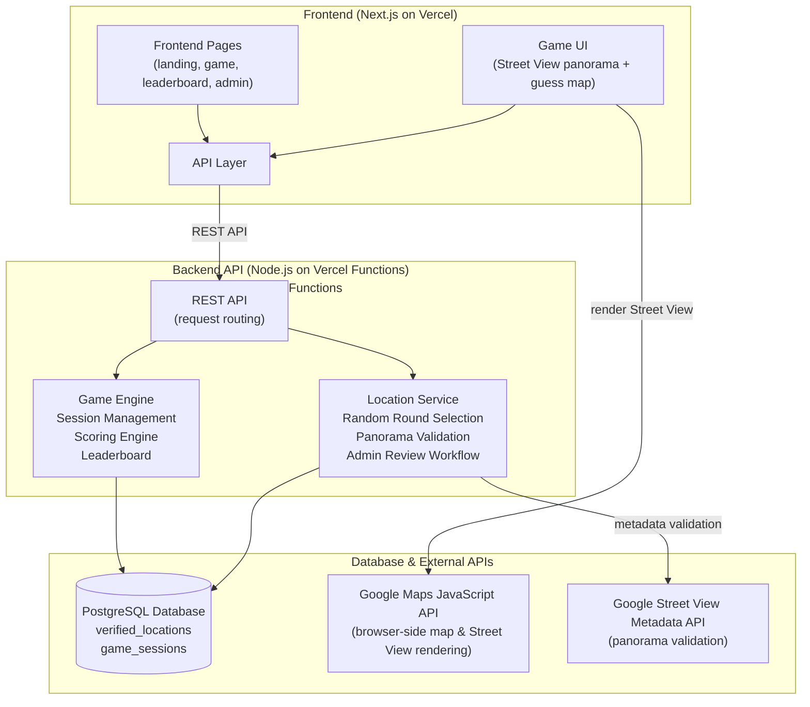
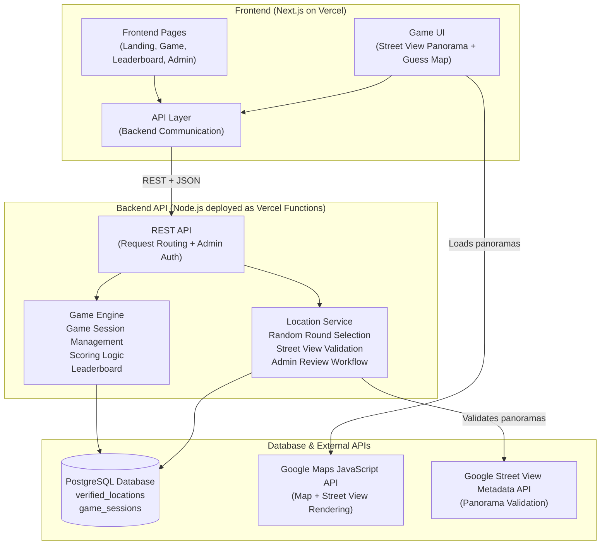
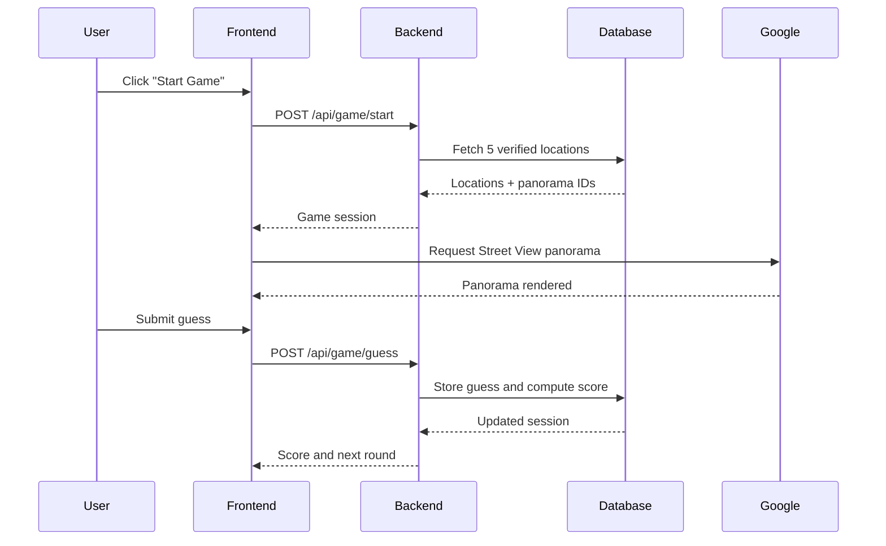

```mermaid
flowchart LR
    A["1. Player clicks 'Start Game'"] --> B["2. Frontend sends POST /api/game/start"]

    B --> C["3. Backend Game Engine"]

    C --> D["4. Query PostgreSQL<br/>Fetch 5 verified locations"]

    D --> E["5. Create game session"]

    E --> F["6. Return locations + session ID"]

    F --> G["7. Frontend loads Street View<br/>using Google Maps JS API"]

    G --> H["8. Player submits guess"]

    H --> I["9. POST /api/game/guess"]

    I --> J["10. Backend computes distance<br/>using Haversine formula"]

    J --> K["11. Update session & score<br/>in PostgreSQL"]

    K --> L["12. Return score<br/>and next round"]
```

# TorontoGuessr

TorontoGuessr is a Toronto-only Street View guessing game with a Next.js frontend, a small Node backend, and Supabase for persistence.

Players get five Toronto Street View locations, place guesses on a map, and earn points based on geographic accuracy. The app also includes leaderboards, daily gameplay stats, SEO metadata routes, and an admin review tool for manually approving or rejecting cached Street View locations.

## Stack

- Frontend (`frontend/`): Next.js, React, Tailwind CSS
- Backend (`backend/`): Node.js, TypeScript, Vercel Functions
- Database: Supabase (PostgreSQL)
- External APIs: Google Maps JavaScript API, Google Street View Metadata API

## Architecture



> **Design Principle:** The frontend is responsible for rendering the user experience, while the backend contains all business logic, persistence, and location validation through stateless serverless functions.

Key flows:

- Starting a game selects five verified locations and creates a session; only panorama ids and headings reach the browser, never the answer coordinates.
- The browser renders Street View and the guess map directly through the Google Maps JS API; the backend is not in the rendering path.
- Guesses are scored server-side (haversine distance, 0 to 5,000 points) so scores cannot be forged client-side.
- Leaderboards and stats aggregate finished `game_sessions` rows by period.
- Admin review routes are gated by an `x-admin-token` header checked against `ADMIN_REVIEW_TOKEN`.

## Design & UI

The frontend uses a custom design system ("Cartographic Premium") built on Tailwind CSS and a small set of reusable components.

- **Theming:** semantic HSL design tokens drive both a cool paper-white light theme and a deep-navy dark theme (the default). Toronto brand accents (navy, azure, sky, red, gold) live in dedicated tokens. A floating control in the bottom-right corner toggles the site between light and dark.
- **Toronto identity:** an ambient backdrop layers a cartographic grid, a soft azure spotlight, and color blooms, with a Toronto skyline anchoring the footer and a CN Tower-inspired logo mark, understated, not touristy. Drop a `cn-tower-logo.png` or `toronto-skyline.png` into `frontend/public/` to swap in your own art; the built-in vector versions are used otherwise.
- **Map-first gameplay:** an immersive Street View stage with a floating glass HUD (round, score, animated timer ring) and a floating guess panel; round and final results animate scores with count-ups and reveal transitions.
- **Readable maps:** the guess and results maps have their own light/dark appearance, independent of the site theme and toggled from a button on the map (remembered across sessions), so the map stays legible in either mode.
- **Shared components:** global chrome (`AppShell`, `Navbar`, `Footer`, `TorontoBackdrop`) plus building blocks (`SectionHeading`, `StatCard`, `Reveal`, `CountUp`, `Spinner`, `LoadingScreen`, `EmptyState`, `ErrorCard`, `GameHUD`, `GuessPanel`, `LeaderboardPodium`) live in `frontend/components/site/` and `frontend/components/`.
- **Accessibility & motion:** semantic HTML, labeled controls, a skip-to-content link, visible focus rings, and a global `prefers-reduced-motion` guard that disables animations for users who opt out.
- **Responsive:** every page is tuned for desktop, tablet, and mobile, including a stacked mobile gameplay layout that keeps Street View and the guess map usable on small screens.

Gameplay, scoring, leaderboards, statistics, authentication, the admin review workflow, and all backend APIs are unchanged. This was a presentation-layer redesign.

## Repo Layout

```text
.
├── frontend/
├── backend/
├── scripts/
└── package.json
```

## Requirements

- Node.js 20+
- npm 10+
- A Supabase project
- A Google Maps API key with the APIs your app uses enabled

## Local Setup

1. Install dependencies:

   ```bash
   npm install
   ```

2. Copy the env examples:

   ```bash
   cp backend/.env.example backend/.env
   cp frontend/.env.example frontend/.env
   ```

3. Create a Supabase project.

4. For a fresh database, run [backend/supabase/schema.sql](backend/supabase/schema.sql) in the Supabase SQL editor.

   This schema enables Row Level Security (RLS) on the app tables. The backend uses the Supabase `service_role` key, so it continues to work while anonymous access stays blocked by default.

   If you already had an older TorontoGuessr schema, also run [backend/supabase/add_verified_location_review_columns.sql](backend/supabase/add_verified_location_review_columns.sql) to add the manual review fields.

   If Supabase is warning that RLS is disabled on an existing project, also run [backend/supabase/enable_row_level_security.sql](backend/supabase/enable_row_level_security.sql).

   Also run [backend/supabase/add_stats_function_and_indexes.sql](backend/supabase/add_stats_function_and_indexes.sql). It adds the `daily_game_stats` SQL aggregate (exact stats regardless of row volume) and leaderboard indexes. Without it the backend falls back to a slower row scan whose counts cap at 1,000 sessions per range.

   Also run [backend/supabase/add_pick_game_rounds_function.sql](backend/supabase/add_pick_game_rounds_function.sql). It adds the `pick_game_rounds` sampler so game starts select rounds in SQL instead of scanning the whole location table (which caps at 1,000 rows). The backend falls back to the scan until it is applied.

5. Fill in `backend/.env` using [backend/.env.example](backend/.env.example):

   ```env
   PORT=3001
   SUPABASE_URL=https://your-project-ref.supabase.co
   SUPABASE_SERVICE_ROLE_KEY=your-service-role-key
   LOCATION_GENERATION_ENABLED=false
   NEXT_PUBLIC_GOOGLE_MAPS_API_KEY=your-google-maps-api-key
   ADMIN_REVIEW_TOKEN=your-long-random-admin-token
   ```

6. Fill in `frontend/.env` using [frontend/.env.example](frontend/.env.example):

   ```env
   NEXT_PUBLIC_API_BASE_URL=http://localhost:3001/api
   SITE_URL=http://localhost:3000
   NEXT_PUBLIC_GOOGLE_MAPS_API_KEY=your-google-maps-api-key
   ```

7. Start the app:

   ```bash
   npm run dev
   ```

Frontend runs on `http://localhost:3000` and the backend runs on `http://localhost:3001`.

## Supabase Setup

For normal app usage, the backend needs:

- `SUPABASE_URL`
- `SUPABASE_SERVICE_ROLE_KEY`

You can find both in the Supabase dashboard:

- `SUPABASE_URL`: project dashboard -> `Connect` -> `Project URL`
- `SUPABASE_SERVICE_ROLE_KEY`: `Settings` -> `API Keys` -> `service_role`

Use the project URL itself, for example:

```env
SUPABASE_URL=https://your-project-ref.supabase.co
```

Do not use `NEXT_PUBLIC_SUPABASE_*` variables here. This app talks to Supabase from the backend, not from the browser.

Because the public tables have RLS enabled, the backend should use `SUPABASE_SERVICE_ROLE_KEY`, not an anon key.

## Data Model

The Supabase schema creates two main tables:

- `verified_locations`: cached Toronto Street View locations with `lat`, `lng`, `pano_id`, `manually_verified`, and `review_status`
- `game_sessions`: persisted game state, results, and finished sessions used for leaderboards and stats

Notes:

- `manually_verified = true` means a location was explicitly approved in the admin review tool.
- `review_status` is one of `pending`, `accepted`, or `rejected`.
- Gameplay prefers manually verified locations first and excludes rejected ones.
- Leaderboards are derived from finished `game_sessions` rows.

## Gameplay And Leaderboards

Main gameplay behavior:

- each game starts a five-round session
- rounds are selected from cached verified locations in Supabase
- if generation is enabled and the cache is too small, the backend can generate more verified Toronto locations using Street View metadata
- scores are based on guess distance from the true location

Leaderboard behavior:

- `lifetime`, `daily`, `weekly`, and `monthly` periods are supported
- the frontend shows a top-5 preview first
- `lifetime` expands to a top-25 view
- `daily`, `weekly`, and `monthly` keep pagination after the preview

## Verified Location Review Workflow

The admin review page lives at `/admin/review-locations`.

It is designed to manually filter out bad Street View cache entries, especially indoor or unusable panoramas. The review UI includes:

- Street View panorama preview
- 2D map preview with a marker on the saved coordinates
- `Accept`, `Reject`, `Previous`, `Next`, and `Undo Last Action`

Review behavior:

- `Accept`: sets `manually_verified = true` and `review_status = accepted`
- `Reject`: sets `review_status = rejected` and removes the row from the active review queue
- `Undo Last Action`: restores the most recently accepted or rejected row to `pending` and returns the queue to that specific location

Admin access is protected by `ADMIN_REVIEW_TOKEN`, which must be sent to the backend through the review UI.

## Verified Location Generation

There are now two ways verified locations can be added:

1. Runtime generation during gameplay if `LOCATION_GENERATION_ENABLED=true`
2. Manual bulk generation with [backend/scripts/generate-verified-locations.ts](backend/scripts/generate-verified-locations.ts)

To generate `100` more verified locations:

```bash
npm run generate:verified-locations --workspace backend
```

To generate a custom number:

```bash
npm run generate:verified-locations --workspace backend -- 25
```

The script validates Street View coverage, skips duplicate panoramas already stored in Supabase, and inserts only newly verified rows.

## Stats And SEO

The backend exposes a gameplay stats endpoint at `GET /api/stats/games`.

It returns:

- total games started
- total games finished
- a daily time-series for the requested range

Query parameters:

- `days`: optional, `1-365`, defaults to `30`
- `timeZone`: optional, defaults to `America/Toronto`

The frontend also includes Next.js metadata routes for:

- `robots.txt`
- `sitemap.xml`

These use `SITE_URL` when available. The `/game` route is excluded from crawling because it auto-starts a game session.

## Scripts

From the repo root:

- `npm run dev`: start frontend and backend together
- `npm run build`: build-check backend and frontend
- `npm run start`: start frontend and backend in production mode

Workspace-specific:

- `npm run dev --workspace frontend`
- `npm run dev --workspace backend`
- `npm run generate:verified-locations --workspace backend`

## API

Main backend routes:

- `GET /api/health`
- `POST /api/games/start`
- `POST /api/games/:sessionId/guess`
- `POST /api/games/:sessionId/next`
- `POST /api/games/:sessionId/username`
- `GET /api/leaderboard?period=lifetime|daily|weekly|monthly&page=1&limit=10`
- `GET /api/stats/games?days=30&timeZone=America/Toronto`
- `GET /api/admin/review-locations?index=0`
- `GET /api/admin/review-locations?locationId=<uuid>`
- `PATCH /api/admin/review-locations/:locationId` with `{ "action": "accept" | "reject" | "undo" }`

## Deploying To Vercel

This repo is easiest to deploy as two Vercel projects.

### 1. Backend project

- import the same Git repo into Vercel
- set the root directory to `backend`
- framework preset: `Other`
- build command: `npm run build`

Backend env vars:

```env
SUPABASE_URL=https://your-project-ref.supabase.co
SUPABASE_SERVICE_ROLE_KEY=your-service-role-key
LOCATION_GENERATION_ENABLED=false
NEXT_PUBLIC_GOOGLE_MAPS_API_KEY=your-google-maps-api-key
ADMIN_REVIEW_TOKEN=your-long-random-admin-token
```

Notes:

- `NEXT_PUBLIC_GOOGLE_MAPS_API_KEY` on the backend is only needed if the backend still performs Street View metadata lookups for migration, generation, or pano backfill.
- If `verified_locations` is already fully seeded with `pano_id` values and generation is disabled, the backend can usually run without that key.

### 2. Frontend project

- import the same Git repo again
- set the root directory to `frontend`
- framework preset: `Next.js`

Frontend env vars:

```env
NEXT_PUBLIC_API_BASE_URL=https://your-backend-project.vercel.app/api
SITE_URL=https://www.torontoguessr.ca
NEXT_PUBLIC_GOOGLE_MAPS_API_KEY=your-google-maps-api-key
```

Deploy order:

1. deploy the backend project first
2. copy its production URL
3. set `NEXT_PUBLIC_API_BASE_URL` in the frontend project
4. deploy the frontend project

## Google Maps Key Notes

The frontend Google Maps JavaScript key should allow the domains you actually use, for example:

- `https://www.torontoguessr.ca/*`
- `https://torontoguessr.ca/*`
- `http://localhost:3000/*`

If you use preview deployments, also add the preview domain pattern.

Right now the repo can use the same Google key on both frontend and backend, but a cleaner long-term setup is:

- browser key for frontend Maps / Street View UI, restricted by HTTP referrer
- server key for backend Street View metadata requests

## Notes

- The frontend always needs a Google Maps API key because gameplay and review tooling both use Google Maps and Street View.

## Interview Diagram



> **Design Principle:** The frontend is responsible for rendering the user experience, while the backend contains all business logic, persistence, and location validation through stateless serverless functions.




