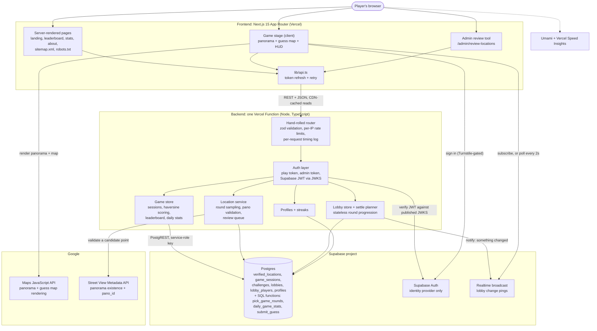
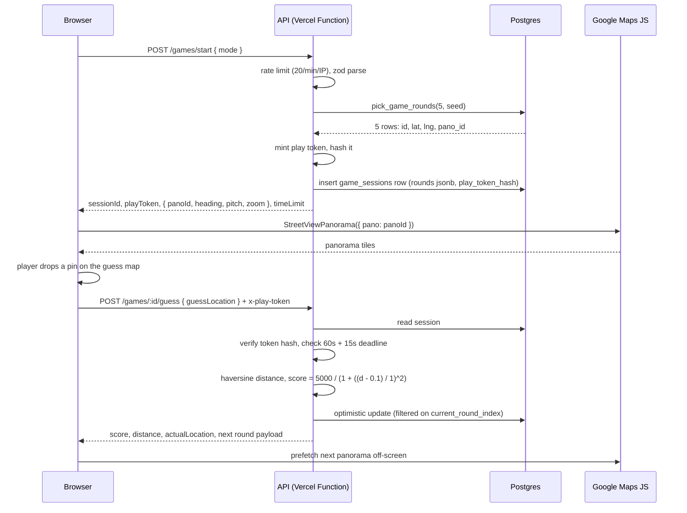
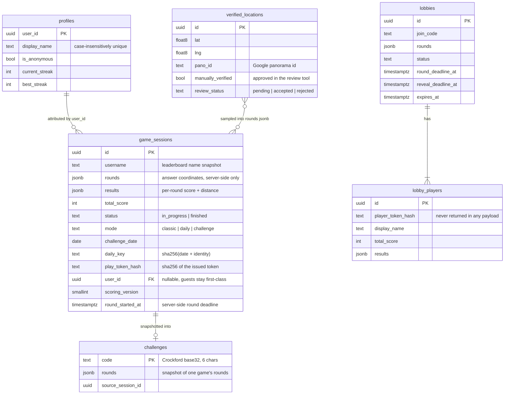

# TorontoGuessr

A Toronto Street View location-guessing game with **3,871 games played** by real
players. Live at **[www.torontoguessr.ca](https://www.torontoguessr.ca)**.

**[Play now](https://www.torontoguessr.ca)** ·
[Architecture](#architecture) ·
[How a round works](#how-a-round-works) ·
[Production engineering](#production-engineering) ·
[Engineering problems worth reading about](#engineering-problems-worth-reading-about)

You get dropped into a real Toronto Street View panorama with no map, no
compass, and 60 seconds. Read the signage, the transit, the architecture, and
the skyline, then drop a pin on the map where you think the photo was taken.
Five rounds, up to 5,000 points each, scored by how far off you were. There is a
daily challenge everyone plays on the same five locations, shareable challenge
links, real-time multiplayer lobbies, and daily and all-time leaderboards. No
sign-up needed to play.

| | |
| --- | --- |
| **3,871 games started, 1,828 finished** | verifiable live from the public [stats endpoint](#api) |
| **Google Street View + Maps JS API** | live panoramas, not pre-downloaded images |
| **Next.js 15 / React 19 on Vercel** | App Router, server-rendered marketing pages, client game stage |
| **Supabase Postgres, service-role only** | RLS enabled with zero policies on all six tables |
| **Server-authoritative scoring** | answer coordinates never reach the browser |
| **316 unit tests + browser suite** | plus CodeQL, a 15-minute production smoke test, and Dependabot |

<!--
SCREENSHOTS GO HERE. Capture the five images listed in the project notes, drop
them in docs/screenshots/, and uncomment this block:

## Screenshots

| Guessing | Result |
| --- | --- |
|  |  |


| Leaderboard | Location review tool |
| --- | --- |
|  |  |
-->

---

## Contents

- [Architecture](#architecture)
- [How a round works](#how-a-round-works)
- [Scoring, and why the curve looks like that](#scoring-and-why-the-curve-looks-like-that)
- [Google Maps and Street View integration](#google-maps-and-street-view-integration)
- [Data model](#data-model)
- [Production engineering](#production-engineering)
- [Engineering problems worth reading about](#engineering-problems-worth-reading-about)
- [Real-world usage](#real-world-usage)
- [Testing](#testing)
- [Project structure](#project-structure)
- [Local development](#local-development)
- [Deployment](#deployment)
- [API](#api)

---

## Architecture

Two independently deployed Vercel projects against one Supabase Postgres
database. The frontend renders; the backend owns every rule that could be
cheated.


```mermaid
flowchart TB
    Player(["Player's browser"])

    subgraph FE["Frontend: Next.js 15 App Router (Vercel)"]
        Pages["Server-rendered pages<br/>landing, leaderboard, stats, about,<br/>sitemap.xml, robots.txt"]
        Stage["Game stage (client)<br/>panorama + guess map + HUD"]
        Admin["Admin review tool<br/>/admin/review-locations"]
        ApiClient["lib/api.ts<br/>token refresh + retry"]
    end

    subgraph BE["Backend: one Vercel Function (Node, TypeScript)"]
        Router["Hand-rolled router<br/>zod validation, per-IP rate limits,<br/>per-request timing log"]
        Guards["Auth layer<br/>play token, admin token,<br/>Supabase JWT via JWKS"]
        Game["Game store<br/>sessions, haversine scoring,<br/>leaderboard, daily stats"]
        Loc["Location service<br/>round sampling, pano validation,<br/>review queue"]
        Lobby["Lobby store + settle planner<br/>stateless round progression"]
        Prof["Profiles + streaks"]
    end

    subgraph Data["Supabase project"]
        PG[("Postgres<br/>verified_locations, game_sessions,<br/>challenges, lobbies, lobby_players, profiles<br/>+ SQL functions: pick_game_rounds,<br/>daily_game_stats, submit_guess")]
        Auth["Supabase Auth<br/>identity provider only"]
        RT["Realtime broadcast<br/>lobby change pings"]
    end

    subgraph Google["Google"]
        MapsJS["Maps JavaScript API<br/>panorama + guess map rendering"]
        Meta["Street View Metadata API<br/>panorama existence + pano_id"]
    end

    Analytics["Umami + Vercel Speed Insights"]

    Player --> Pages
    Player --> Stage
    Player --> Admin
    Player -.-> Analytics
    Pages --> ApiClient
    Stage --> ApiClient
    Admin --> ApiClient
    ApiClient -- "REST + JSON, CDN-cached reads" --> Router
    Router --> Guards
    Guards --> Game
    Guards --> Loc
    Guards --> Lobby
    Guards --> Prof
    Game -- "PostgREST, service-role key" --> PG
    Loc --> PG
    Lobby --> PG
    Prof --> PG
    Guards -- "verify JWT against published JWKS" --> Auth
    Stage -- "sign in (Turnstile-gated)" --> Auth
    Lobby -- "notify: something changed" --> RT
    Stage -- "subscribe, or poll every 2s" --> RT
    Stage -- "render panorama + map" --> MapsJS
    Loc -- "validate a candidate point" --> Meta
```

Three deliberate boundaries hold this together:

1. **The backend is the only thing that talks to application data.** Every one
   of the six tables has row level security enabled with *no policies at all*,
   so the anon key and the `authenticated` role can read nothing. The backend
   uses the service-role key. This is not belt-and-braces: `lobbies.rounds` and
   `challenges.rounds` contain answer coordinates, so a readable SELECT policy
   would hand players the answers.
2. **Supabase Auth is an identity provider and nothing more.** It answers "who
   is this" via a JWT the backend verifies against the project's published JWKS.
   Data access never moves to the client.
3. **The browser never receives an answer.** A round payload is
   `{ panoId, heading, pitch, zoom }`. The latitude and longitude stay
   server-side until the moment you have already guessed.

The backend has exactly two runtime dependencies, `jose` and `zod`. The router
and the PostgREST client are both written by hand.

---

## How a round works


```mermaid
sequenceDiagram
    participant B as Browser
    participant A as API (Vercel Function)
    participant D as Postgres
    participant G as Google Maps JS

    B->>A: POST /games/start { mode }
    A->>A: rate limit (20/min/IP), zod parse
    A->>D: pick_game_rounds(5, seed)
    D-->>A: 5 rows: id, lat, lng, pano_id
    A->>A: mint play token, hash it
    A->>D: insert game_sessions row (rounds jsonb, play_token_hash)
    A-->>B: sessionId, playToken, { panoId, heading, pitch, zoom }, timeLimit
    B->>G: StreetViewPanorama({ pano: panoId })
    G-->>B: panorama tiles
    B->>B: player drops a pin on the guess map
    B->>A: POST /games/:id/guess { guessLocation } + x-play-token
    A->>D: read session
    A->>A: verify token hash, check 60s + 15s deadline
    A->>A: haversine distance, score = 5000 / (1 + ((d - 0.1) / 1)^2)
    A->>D: optimistic update (filtered on current_round_index)
    A-->>B: score, distance, actualLocation, next round payload
    B->>G: prefetch next panorama off-screen
```

1. **Location selection.** `pick_game_rounds(round_count, seed)` is a Postgres
   function. It de-duplicates by `pano_id` with a window function, excludes
   anything `review_status = 'rejected'`, orders manually reviewed locations
   first, then randomises and takes the top *n*. One round trip, no table scan.
   Passing a seed calls `setseed()` first, which is how the daily challenge
   deals every player on a given Toronto date the identical five locations. The
   seed is an FNV-1a hash of the date string.
2. **Street View retrieval.** The panorama is fetched by `pano_id` directly by
   the browser through the Maps JavaScript API. The backend is not in the
   rendering path and pays no per-render API cost.
3. **Submitting a guess.** The browser POSTs a lat/lng pair, bounded by zod to
   real coordinate ranges, plus the play token in an `x-play-token` header.
4. **Distance.** Haversine on a 6,371 km sphere. Great-circle rather than a
   planar approximation, which for a city-scale game is defensive rather than
   necessary, but it costs nothing and never surprises you.
5. **Score.** See below.
6. **Persistence.** The round result is appended to `results` jsonb and
   `total_score` is incremented in a single conditional update whose filter
   includes the round index the client last saw, so a double-submitted guess
   matches zero rows instead of scoring twice. The next round payload rides back
   on the same response, so a round transition needs no extra API call.
7. **Results and stats.** Leaderboards are pages over finished sessions ordered
   by `total_score`, with per-account display names resolved live in one extra
   query. Daily stats come from `daily_game_stats(days_count, tz)`, a SQL
   aggregate returning one row per day.

---

## Scoring, and why the curve looks like that

```
score(d) = 5000                                for d <= 0.1 km
score(d) = round(5000 / (1 + ((d - 0.1) / 1)^2))   otherwise
```

The interesting part is not the formula, it is the calibration. The original
curve was linear from 100 m to 2 km and zero beyond, which was the wrong scale
for this game by an order of magnitude. The playable area is roughly 4.8 by
5.1 km, so a random click inside it lands about 2.6 km from the answer, and the
old curve scored that exactly the same as a guess on another continent: zero.
Recognising the right neighbourhood and missing by 2.1 km also scored zero. The
game could not tell knowledge from ignorance, which is the one thing it exists
to measure.

The replacement is a `1/(1 + x^2)` decay with two calibrated constants:

- **100 m plateau.** Street View panoramas sit 10 to 20 m apart and the subject
  of a photo can be a block from the camera, so demanding better than 100 m
  would be scoring noise.
- **1 km half-score.** Toronto's 158 named neighbourhoods cover about 630 km<sup>2</sup>,
  averaging 4 km<sup>2</sup> each, an equivalent radius of ~1.13 km. So "you found the
  right neighbourhood" and "you scored about half" mean the same thing by
  construction.

At 1 km you get 2,762. That average uninformed click gets ~690. A 20 km miss
gets 13. Informed play now earns roughly four times ignorant play, and genuine
ignorance still rounds towards nothing without a cliff.

Two details that matter in practice:

- The formula is written `decay * decay` rather than `Math.pow`, and uses no
  `exp` or `log`, because it is duplicated in SQL
  ([`score_for_distance_km`](backend/supabase/rescore_history_to_city_scale.sql)).
  Restricted to multiplication and division, JavaScript and Postgres perform
  identical IEEE 754 operations and cannot drift apart by a point.
- Changing the curve orphaned 3,220 historical sessions on the old one, so the
  all-time leaderboard was comparing two different games. The
  [rescore migration](backend/supabase/rescore_history_to_city_scale.sql)
  recomputes every stored round from the `distance` already recorded on it,
  which makes the rescore lossless rather than an estimate. It verifies the SQL
  curve against the same 15 reference vectors the TypeScript unit tests use,
  performs the update, and asserts three integrity properties, all inside one
  `DO` block so any failure rolls the whole thing back regardless of how the
  client handles errors. (That last part was learned the hard way: as two
  separate blocks, `psql` without `ON_ERROR_STOP` happily continued past the
  failed curve check and rescored everything with the wrong curve.)

---

## Google Maps and Street View integration

"Uses the Google Maps API" is not the interesting part. These are:

**Finding valid locations at all.** There is no API that says "give me a Street
View panorama in this box." The pipeline generates a uniformly random point
inside `TORONTO_BOUNDS` (43.6363 to 43.6798 N, -79.4136 to -79.3501 W), asks the
**Street View Metadata API** whether imagery exists there, and keeps the
`pano_id` and the *snapped* coordinates Google returns rather than the ones that
were asked for. Metadata requests are free, which is why validation happens
there and not against an imagery endpoint.

**Not paying for the same lookup twice.** Every validated panorama is written to
`verified_locations`. Gameplay reads that table, so a location costs one
metadata request in its entire lifetime instead of one per round it appears in.
Runtime generation is behind `LOCATION_GENERATION_ENABLED` and is off in
production; the pool is grown deliberately with
[`generate-verified-locations.ts`](backend/scripts/generate-verified-locations.ts),
which also skips panorama ids already in the table. Legacy rows with no
`pano_id` are validated lazily on first use and the result is written back, and
if that write fails the process disables location writes and keeps serving the
game rather than failing a request over a cache miss.

**Coverage is not the same as playability.** Metadata says imagery exists. It
does not say the panorama is a street: indoor business photospheres, transit
station interiors, and parking garages all validate fine and are unguessable.
That is what the [admin review tool](#admin-review-and-moderation) exists for,
and why `pick_game_rounds` orders reviewed locations first.

**Serving the panorama without the answer.** The client is handed a `pano_id`,
never coordinates. `StreetViewPanorama` renders from a pano id alone, so the
browser can display the exact photo without being told where it is. The heading
is randomised per round so a panorama that shows up twice does not open on the
same view.

**Two panorama instances, one visible.** `GamePanorama` is constructed once per
mount and retargeted with `setPano()` on later rounds rather than being torn
down and rebuilt. Meanwhile `PanoPrefetch` mounts an invisible off-screen
`StreetViewPanorama` for the *next* round while the player reads their result,
so the transition is instant. That prefetch surface is wrapped in an outer div
Google never touches, because Maps writes inline styles (including
`position: relative`) onto whatever node it is handed, which once dropped a
256px blank block above the round results on every round.

**The guess map is a UI surface, not a reference map.** Points of interest,
transit icons, and road label icons are all styled off, and it carries its own
light/dark theme independent of the site theme (remembered across sessions),
because a dark map with a dark pin is unreadable. Result views frame guess and
answer together and label the connecting line with the distance the **server**
returned, not one recomputed in the browser, so the number can never disagree
with the score printed next to it.

**A known, documented approximation.** `midpoint()` averages two coordinate
pairs instead of using `spherical.interpolate`, because pulling in the
`geometry` library would have to be threaded through four separate
`useJsApiLoader` call sites (`@react-google-maps/api` throws if two loads
request different options), and over a few km the two answers differ by less
than a pixel. It is flagged in the source as unsafe to lift into a global
context, since averaging 179 and -179 gives you the opposite side of the planet.

---

## Data model

Six tables. The three that matter most:


```mermaid
erDiagram
    verified_locations {
        uuid id PK
        float8 lat
        float8 lng
        text pano_id "Google panorama id"
        bool manually_verified "approved in the review tool"
        text review_status "pending | accepted | rejected"
    }
    game_sessions {
        uuid id PK
        text username "leaderboard name snapshot"
        jsonb rounds "answer coordinates, server-side only"
        jsonb results "per-round score + distance"
        int total_score
        text status "in_progress | finished"
        text mode "classic | daily | challenge"
        date challenge_date
        text daily_key "sha256(date + identity)"
        text play_token_hash "sha256 of the issued token"
        uuid user_id FK "nullable, guests stay first-class"
        smallint scoring_version
        timestamptz round_started_at "server-side round deadline"
    }
    profiles {
        uuid user_id PK
        text display_name "case-insensitively unique"
        bool is_anonymous
        int current_streak
        int best_streak
    }
    challenges {
        text code PK "Crockford base32, 6 chars"
        jsonb rounds "snapshot of one game's rounds"
        uuid source_session_id
    }
    lobbies {
        uuid id PK
        text join_code
        jsonb rounds
        text status
        timestamptz round_deadline_at
        timestamptz reveal_deadline_at
        timestamptz expires_at
    }
    lobby_players {
        uuid id PK
        text player_token_hash "never returned in any payload"
        text display_name
        int total_score
        jsonb results
    }
    profiles ||--o{ game_sessions : "attributed by user_id"
    game_sessions ||--o| challenges : "snapshotted into"
    lobbies ||--|{ lobby_players : has
    verified_locations }o--o{ game_sessions : "sampled into rounds jsonb"
```

Decisions worth calling out:

- **Rounds are denormalised into `jsonb`, not joined.** A game is immutable once
  dealt, and a location can be rejected or deleted afterwards. Referencing
  `verified_locations` by id would let a moderation action retroactively change a
  finished game. Challenge links snapshot rounds for the same reason: a
  seed-based scheme would silently stop reproducing the same five locations as
  the pool changed.
- **`user_id` is `ON DELETE SET NULL`, emphatically not `CASCADE`.**
  `purge_stale_anonymous_users()` deletes from `auth.users`. Under CASCADE that
  cleanup would delete those players' *games*, silently removing finished scores
  from the leaderboard. Losing attribution is an acceptable consequence of
  deleting an account; losing the game is not. The purge function is separately
  hardened to never delete a user with any game to their name.
- **`scoring_version` was added before it was needed**, because it is a one-way
  door. Once a second curve ships there is no way to work out afterwards which
  curve produced an existing row, so the leaderboard could never separate them
  or label the seam. One nullable `smallint`, recorded from the first scored
  game.
- **The daily one-attempt rule is a partial unique index**, not a backend check:
  `unique (challenge_date, daily_key) where mode = 'daily' and daily_key is not null`.
  A read-then-write check loses a race; an index cannot be raced and holds even
  for a caller that bypasses the route entirely. It is partial so it stays off
  the 3,200+ classic rows and so null keys can never collide.
- **Indexes are shaped to the actual query plans**: a composite
  `(status, total_score desc, completed_at asc)` for the leaderboard page *and*
  its exact count, `(mode, challenge_date, total_score desc) where status = 'finished'`
  for the per-day board, `(user_id, completed_at desc) where user_id is not null`
  for account history, `(manually_verified, review_status, created_at)` for the
  review queue, and a partial `(created_at) where is_anonymous and last_played_date is null`
  for the account purge. `play_token_hash` deliberately has *no* index: nothing
  ever looks a session up by it, so an index would be pure write cost.
- Migrations are individually applied SQL files in
  [`backend/supabase/`](backend/supabase), each one idempotent, each one
  documenting why it exists and what it is safe to run twice.

---

## Production engineering

The parts that only exist because this thing is actually deployed and actually
gets traffic.

### Anti-cheat, in layers

Every one of these closed a hole that was real, not theoretical.

| Mechanism | What it stops |
| --- | --- |
| Answer coordinates never in a round payload | reading the answer out of the network tab |
| Server-side scoring | forging a score client-side |
| **Play token**: 32 bytes of CSPRNG, only its sha256 stored, sent as `x-play-token` | Session ids are *published* on the leaderboard as `entry.id`. Every route keyed on a session id alone was therefore open to everyone, and `POST /games/:id/username` let anybody rename any finished leaderboard entry to anything. A session id identifies a game; it does not authenticate a player. |
| Round deadline enforced server-side (60s + 15s grace, from `round_started_at`) | stopping the client clock |
| `/games/:id/next` deliberately does **not** reset the deadline | pinging `/next` during a round to push the timeout out indefinitely |
| Game summary omits `actualLocation` and `guessLocation` | Anyone could fetch a finished session's summary by id. On the daily, where everybody plays the same five rounds, one stranger's finished game was the answer key for the whole day. |
| Challenge links can only be minted from a **finished** game | minting a challenge from your own in-progress game, replaying it with five null guesses to read every answer out of the guess responses, then submitting them into the original for a perfect 25,000 |
| Daily attempt uniqueness (partial index) | playing the daily, writing five coordinates on a notepad, restarting, and posting 25,000 |
| Challenge-mode games excluded from the global board | a replayable game ranking against one-shot games |
| `lobby_players.player_token_hash` never returned in any payload | replaying a leaked row as a credential |

Both token comparisons hash both sides before `timingSafeEqual`, so the buffers
are always equal length (`timingSafeEqual` throws on a length mismatch, which
would itself leak) and no length information escapes.

### Caching and API cost

- **Location cache.** One Street View metadata request per location for its
  whole lifetime, instead of one per round it is used in.
- **CDN caching on read routes.** The leaderboard sets
  `s-maxage=30, stale-while-revalidate=60`; stats set
  `s-maxage=60, stale-while-revalidate=300`. Both are set *only on success*, so
  an error response is never cached.
- **CORS preflight cached for a day** (`Access-Control-Max-Age: 86400`), so
  gameplay POSTs pay the preflight at most once per day rather than before
  every request.
- **Panorama prefetch** warms the next round's tiles during the reveal.
- **`preconnect` / `dns-prefetch`** for the three Google origins in the document
  head, so the game page is not paying TLS setup at the moment it needs a
  panorama.
- **Round trip elimination.** `/games/start` used to re-read the row it had just
  inserted in order to build the round payload, a third sequential Supabase
  round trip for data already in hand. `/games/:id/guess` returns the next round
  inline, so a round transition costs zero API calls. There is an opt-in SQL path
  (`submit_guess`, behind `GUESS_RPC_ENABLED`) that scores a guess in one atomic
  database call instead of read-then-write, with a fallback to the JavaScript path
  on any RPC failure.

### The 1,000-row wall

PostgREST caps responses at 1,000 rows by default, and three separate features
were quietly wrong because of it. Each was moved into SQL:

| Was | Became |
| --- | --- |
| fetch all locations, shuffle in JS | `pick_game_rounds(round_count, seed)` |
| fetch all sessions in range, bucket by day in JS | `daily_game_stats(days_count, tz)` |
| read-then-write guess scoring | `submit_guess(...)` (opt-in) |

Each one is called through PostgREST RPC with the **old path kept as a
fallback**, selected by a per-process flag that flips the first time the RPC
reports missing. That is what makes every migration in this repo safe to apply
at any time, in any order, before or after the code that uses it ships.

### Graceful degradation as a design constraint

The backend runs against databases at different migration levels (local, a
Docker Postgres, production) and must not care. Optional columns are grouped
**one flag per migration**, and a group is switched off for the life of the warm
instance the first time PostgREST says one of its columns does not exist, with a
warning naming the exact migration to run. Inserts and updates rebuild their
payloads from the surviving schema, not just their `select` lists.

Grouping per migration is the load-bearing detail. An earlier version used a
single boolean over one combined column list, which meant a column missing from
the *newer* migration also disabled the *older* one: applying the game-modes
migration but not the play-token one would have silently turned off round
deadlines and daily challenges. Missing tables degrade the same way, to a 503 on
that feature only (`challenges`, `lobbies`, `profiles`), never a crash.

There is a matching hardening detail in the router: `:sessionId` is validated as
a UUID before use, because an unvalidated segment is echoed back verbatim inside
PostgREST's cast error, and the missing-column detector pattern-matches on error
*text*. A crafted session id could therefore have latched a feature flag off for
the life of the instance.

### Rate limiting

An in-memory fixed-window limiter, keyed per IP and namespaced **per route**, so
one busy route cannot lock a player out of another. Every ceiling is reasoned
from the traffic shape rather than picked round: `/games/start` 20/min;
`/guess` and `/next` 120/min, because 20 games a minute times five rounds is 100
legitimate guesses; lobby state 120/min, because clients poll every two seconds
and would 429 at 20; challenge and lobby creation 10/min, because each writes a
row. Checks run *before* body parsing, JWT verification, and any database call,
so a refused request costs almost nothing.

The limiter is honest about what it is: serverless instances each hold their own
map, so it deters casual scripting from a single client rather than enforcing a
hard global cap. Doing that properly needs a shared store.

Admin auth gets a second bucket on top: overall volume capped at 120/min, and
*failed* attempts capped separately at 10/min, so the shared token cannot be
brute forced and a working reviewer session is never locked out by someone else
guessing from the same address.

### Authentication and authorization

- **Players.** Accounts are optional forever, because the landing page promises
  "no sign-up needed". An anonymous Supabase user is minted only after a game
  *finishes*, gated by an invisible Cloudflare Turnstile challenge, and can later
  attach a real credential while keeping the same user id, so progress carries
  over with no data migration.
- **JWT verification.** Done in-process with `jose`. Asymmetric tokens
  (ES256/RS256) verify against the project's published JWKS, so no secret lives
  in this service; HS256 verifies against an optional
  `SUPABASE_JWT_SECRET` for projects still on the legacy symmetric scheme. The
  algorithm is read from the token header, matched against an allowlist, and the
  expected scheme is **pinned per verification path**, which is what defeats
  algorithm confusion. `alg: none` is refused outright. `jose` caches the fetched
  key set, so this is one network call per cold start.
- **Expiry is distinguished from invalidity.** An expired token throws 401 rather
  than being silently downgraded to guest, and the frontend refreshes once and
  retries. Silently downgrading would have quietly lost a signed-in player's
  score attribution.
- **Game attribution is once-only at the database level.** A finished game is
  filed under an account by an update filtered on `user_id is null`, and only by
  the request that performed the `in_progress` to `finished` transition. Since
  finished session ids are public, any other path would let a signed-in player
  claim a stranger's score straight off the leaderboard.
- **Admin.** A single shared token (`ADMIN_REVIEW_TOKEN`), accepted as either
  `x-admin-token` or a bearer token, compared in constant time. The source is
  explicit that this identifies nobody and never expires, and that a role claim
  on a real account is the eventual fix.

### Admin review and moderation

`/admin/review-locations` is a paged queue over pending locations showing the
Street View panorama beside a 2D map marker, with accept, reject, previous,
next, and **undo last action** (which returns the row to `pending` and the queue
to that specific location). Accepting sets `manually_verified = true`, which is
what `pick_game_rounds` orders on; rejecting removes the row from both the queue
and the playable pool. There is a bulk `DELETE .../rejected` for reclaiming
space once rejections pile up.

### Observability

Every request emits one structured line with a total, a database breakdown, and
the app time in between:

```
[timing] POST /games/start 200 total=214.8ms db=176.2ms(r=61.4 w=114.8 n=3) app=38.6ms
```

The accumulator is bound to the request's async context with
`AsyncLocalStorage`, and the PostgREST client adds to it on every call, so no
route has to thread a timing object through and the many early returns in the
router need no wrapping. That `n=3` is how "how many round trips does this route
actually make" became a number instead of a guess.

Beyond that: **Umami** for product analytics, **Vercel Speed Insights** for real
user performance, and a **production smoke test** on every deployment plus a
15-minute cron that probes single-segment routing, multi-segment routing (a real
past outage: nested paths 404ing while `/health` was fine), leaderboard payload
shape, the CORS preflight, and the frontend, then **opens a GitHub issue labelled
`outage` on failure and closes it automatically on recovery**.

### CI and supply chain

Four workflows: [`ci.yml`](.github/workflows/ci.yml) (typecheck, lint, unit
tests, and a real production build for both workspaces, with the Next build
cache keyed on the lockfile plus sources),
[`codeql.yml`](.github/workflows/codeql.yml) (every PR, every push to main, plus
weekly so newly disclosed query patterns reach old code),
[`browser.yml`](.github/workflows/browser.yml) (Playwright against the deployed
site), and [`smoke.yml`](.github/workflows/smoke.yml). Dependabot batches minor
and patch updates weekly into one PR and lets majors open individually. `main`
is protected and the protection is enforced on admins.

Two CI subtleties the workflow comments record: a job-level `if` that references
the `secrets` context makes the whole workflow *file* invalid, which GitHub
reports as a run with zero jobs and no explanation; and previews are excluded
from browser checks on purpose, because a skipped job still reports a green
check, and a green "Browser checks" that ran nothing is worse than no check at
all.

---

## Engineering problems worth reading about

**1. A session id is not a credential.**
*Problem:* the leaderboard publishes session ids as `entry.id`, and four routes
treated a session id as authority. Anyone could rename any finished leaderboard
entry, and earlier patches to `/next` and `/challenge` had treated symptoms.
*Approach:* introduce a real per-game credential rather than keep hardening
individual routes. *Implementation:* `/games/start` mints 32 CSPRNG bytes,
returns them exactly once, and stores only the sha256. Four routes now require
the header and compare digests in constant time. *Tradeoff:* the token exists in
exactly one place, so a client that loses it has lost that game, and 3,232
pre-existing rows had no token at all. The migration writes a deliberate
**non-hex sentinel** over every row older than two hours: a sha256 digest is
always 64 hex characters, so a value that is not cannot be the digest of
anything, and the row becomes permanently unrenameable. That property is
stronger than random bytes, because it does not depend on a random source, and
the migration asserts it with a regex before committing. Rows younger than two
hours keep a null hash and stay grandfathered, so nobody mid-game lost their
game at deploy time.

**2. Scoring a city, not a planet.**
*Problem:* the original linear curve gave zero to a correct-neighbourhood guess
and zero to a guess on another continent, so the game could not distinguish
knowledge from ignorance. *Approach:* derive the constants from the city instead
of picking them. *Implementation:* `1/(1 + x^2)` with a 100 m plateau (Street
View panorama spacing) and a 1 km half-score point (the equivalent radius of an
average Toronto neighbourhood), duplicated in SQL using only multiplication and
division so both languages compute bit-identical IEEE 754 results. *Result:*
informed play earns roughly 4x ignorant play. *Tradeoff:* it invalidated 3,220
historical sessions, so a self-verifying, self-rolling-back rescore migration
had to be written to bring the all-time board onto one curve.

**3. Round progression with nothing running between requests.**
*Problem:* multiplayer needs rounds that end on a timer, but the backend is
stateless serverless functions. There is no process to hold a socket or run a
clock, and a cron job is a whole extra piece of infrastructure to operate.
*Approach:* store deadlines, and have every request settle the lobby before
responding. *Implementation:* [`lobby-settle.ts`](backend/src/lobby-settle.ts) is
a **pure planner**: given the lobby's timing state it returns an ordered list of
steps (reveal this round, scoring absent players as timeouts; advance to the
next; finish), which the store applies under optimistic concurrency. Reveals
advance on host action *or* on a deadline, so a lobby never stalls when the host
closes their laptop. Push notification uses Supabase Realtime **broadcast**, not
Postgres Changes, specifically because Postgres Changes respects RLS and would
require a SELECT policy on `lobbies`, which holds answer coordinates; the
broadcast carries no game state at all, only "something changed", and clients
refetch through the API where the reveal boundary lives. *Tradeoff:* progression
is only as timely as the next request, and clients poll every two seconds as a
floor, so a dropped notification costs latency and never correctness. The
planner being pure is what makes deadlines, host-or-timeout advancement, and the
last-round edge case unit testable without a database.

**4. Coverage is not playability.**
*Problem:* the Street View Metadata API tells you imagery exists, not that it is
a *street*. Indoor photospheres and parking garages validate perfectly and are
unguessable, so an automatically generated pool degrades the game. *Approach:*
keep automatic generation for recall and add a human accept/reject pass for
precision, then let the sampler prefer reviewed rows so quality improves
gradually instead of blocking on a full review. *Implementation:* a `review_status`
enum plus `manually_verified`, an index shaped to the queue query, a paged review
UI with panorama and map side by side and an undo, and `ORDER BY manually_verified DESC, random()`
in the sampler. *Tradeoff:* review is manual work that never finishes, and the
game plays unreviewed locations until it is done. The undo exists because
reviewing hundreds of panoramas quickly means misclicking.

**5. Deploying a schema change and a code change that cannot be atomic.**
*Problem:* two independently deployed Vercel projects and a database whose
migrations are applied by hand mean the code and the schema are never in lockstep,
in either direction. *Approach:* make every feature detect its own schema at
runtime and degrade to a working subset. *Implementation:* per-migration column
groups probed from PostgREST's error text, per-table availability flags, RPC
fallbacks to the pre-RPC code path, and every migration written to be idempotent
and safe to apply before or after its code. *Result:* migrations can be applied
in any order at any time; the worst case is a warning in the logs naming the file
to run and one feature reporting itself unavailable. *Tradeoff:* real complexity
in the data layer, and it is the reason `:sessionId` has to be UUID-validated
before it ever reaches a query, since a crafted id inside an error message could
otherwise trip a feature flag.

---

## Real-world usage

Sampled from the live production API on 2026-08-20. Both numbers come from
public endpoints, so they can be re-checked at any time:

| Metric | Value |
| --- | --- |
| Games started (all time) | **3,871** |
| Games finished | **1,828** (47% completion) |
| Days with recorded play | 134 |
| First recorded play | 2026-04-07 |
| Busiest day | 114 games started (2026-06-24) |
| Highest score on the all-time board | 25,000 (a perfect game) |

```bash
curl "https://toronto-guessr-backend.vercel.app/api/stats/games?days=365"
```

The game is also live in the app itself at
[/stats](https://www.torontoguessr.ca/stats), which charts games started and
finished per day over a selectable range.

---

## Testing

**316 unit tests** across the two workspaces, run on every PR:

```bash
npm run test --workspace backend    # 187 tests
npm run test --workspace frontend   # 129 tests
```

The backend suite covers the pieces where a bug is expensive and hard to see:
the scoring curve against fixed reference vectors (including the fail-closed
cases: NaN, Infinity, negative distance), JWT verification including a **forged
HS256 token** exercising the algorithm-confusion path, the admin token's
constant-time compare and failure lockout, rate-limit window behaviour, play
token grandfathering and rejection, the daily attempt key, streak derivation,
short-code normalisation, and the pure lobby settle planner.

The frontend suite covers the pure logic islands (distance formatting, Toronto
date-key arithmetic, streak advance, share text, game URL params, leaderboard
name reduction, lobby client helpers) plus component tests for the account menu
and the save-progress flow.

**Browser tests** ([`frontend/e2e/`](frontend/e2e)) run with Playwright against
the **deployed** site, not localhost, and that is a constraint rather than a
preference: the Google Maps key is referrer-restricted to production, so a
localhost page gets `RefererNotAllowedMapError` and neither the panorama nor the
guess map ever mounts. The suite plays a real round end to end (asserting both
maps mount, a pin scores, and the results sit flush), and sweeps **17 viewport
widths** across five pages asserting zero horizontal overflow.

That sweep exists because of a specific lesson: 390px and 1280px both measured
4px of overflow and looked perfect, while **640px was scrolling 281px sideways**
and 768px was clipping the navbar's Play button flat against the viewport edge.
Testing two comfortable widths proves nothing about the band between them. The
widths include 767/768/769 to bracket the `md` breakpoint.

The jsdom suite cannot see any of this: jsdom computes no layout,
`getBoundingClientRect` returns zeros, and no stylesheet applies. A 272px blank
gap above the round results (Google Maps writing inline `position: relative`
onto a node whose `fixed` class the layout depended on) was invisible to every
test in the repo and was found by eye, in production. The browser suite is the
only thing that would catch the next one.

**Not covered**, and honestly so: there is no automated integration test against
a real Postgres in CI. The backend *can* be run against `postgres:16-alpine`
plus PostgREST in Docker with a forged HS256 token, and that is how the play
token, streak derivation, and leaderboard naming were all verified, but it is a
manual recipe rather than a CI job.

---

## Project structure

```text
backend/
  api/index.ts              single Vercel Function; every route enters here
  src/
    router.ts               method + path dispatch, zod schemas, rate limits
    game-store.ts           sessions, scoring, leaderboard, daily stats
    lobby-store.ts          multiplayer persistence + optimistic concurrency
    lobby-settle.ts         pure round-progression planner
    scoring-service.ts      haversine + the scoring curve
    services/
      location-service.ts   round sampling, pano validation, review queue
      streetview-service.ts Street View Metadata API client
    supabase.ts             hand-written PostgREST client + timing hooks
    auth.ts                 Supabase JWT verification (JWKS / HS256)
    play-token.ts           per-game credential
    admin-auth.ts           admin token, constant-time, failure lockout
    rate-limit.ts           per-IP, per-route fixed-window limiter
    observability.ts        AsyncLocalStorage request timing
    challenge-store.ts      shareable challenge snapshots
    profile-store.ts        accounts, display names, streaks
  supabase/                 numbered, idempotent, heavily commented migrations
  scripts/                  bulk verified-location generation
  tests/                    vitest

frontend/
  app/
    page.tsx                landing
    game/page.tsx           the game state machine
    lobby/                  multiplayer entry + room
    leaderboard/  stats/  me/  about/
    admin/review-locations/ location moderation UI
    auth/callback/          email/OAuth return
    sitemap.ts  robots.ts
  components/
    gamepanorama.tsx        Street View stage (instance reuse)
    game-map.tsx            guess + results map
    pano-prefetch.tsx       off-screen next-round warmer
    site/                   design system: shell, nav, cards, reveals
    ui/                     shadcn/ui primitives
  lib/
    api.ts                  typed API client, token refresh + retry
    auth-client.ts  supabase-client.ts
    scoring/geometry/date/streak helpers (all pure, all tested)
  e2e/                      Playwright, against the deployed site
  tests/                    vitest + jsdom

scripts/                    root dev/build/start orchestration
.github/workflows/          ci, codeql, browser, smoke
```

---

## Local development

### Requirements

- Node.js 20+ and npm 10+
- A Supabase project
- A Google Maps API key with the Maps JavaScript API and the Street View
  Static/Metadata API enabled

> **Heads up:** Google Maps will not render on `localhost` if your key is
> referrer-restricted to your production domain. You get
> `RefererNotAllowedMapError` and no panorama. Everything that is not a map
> (stats, leaderboard, lobby waiting room, accounts, admin queue metadata)
> works locally; anything map-dependent needs a deployed origin or a
> permissive key.

### 1. Install

```bash
npm install
```

### 2. Set up the database

Run [`backend/supabase/schema.sql`](backend/supabase/schema.sql) in the Supabase
SQL editor, then the migrations below. Each is idempotent and safe to run twice,
and the backend degrades gracefully until each is applied, so order is flexible.

| Migration | Adds | Without it |
| --- | --- | --- |
| [`add_stats_function_and_indexes.sql`](backend/supabase/add_stats_function_and_indexes.sql) | `daily_game_stats` + leaderboard indexes | stats fall back to a row scan capped at 1,000 rows |
| [`add_pick_game_rounds_function.sql`](backend/supabase/add_pick_game_rounds_function.sql) | `pick_game_rounds` sampler | game starts scan the whole location table, capped at 1,000 rows |
| [`add_game_modes_and_deadlines.sql`](backend/supabase/add_game_modes_and_deadlines.sql) | `mode`, `challenge_date`, `round_started_at` | no round deadlines; daily games recorded as classic |
| [`add_play_token_to_game_sessions.sql`](backend/supabase/add_play_token_to_game_sessions.sql) | `play_token_hash` | anyone with a session id can rename its leaderboard entry |
| [`add_daily_attempt_key.sql`](backend/supabase/add_daily_attempt_key.sql) | one-attempt-per-day unique index | the daily can be replayed for a perfect score |
| [`add_challenge_links.sql`](backend/supabase/add_challenge_links.sql) | `challenges` table | challenge endpoints report unavailable |
| [`add_multiplayer_lobbies.sql`](backend/supabase/add_multiplayer_lobbies.sql) | `lobbies`, `lobby_players` | multiplayer reports unavailable |
| [`add_user_accounts.sql`](backend/supabase/add_user_accounts.sql) | `profiles` + purge helper | `/me` routes report unavailable |
| [`link_game_sessions_to_accounts.sql`](backend/supabase/link_game_sessions_to_accounts.sql) | `user_id`, `scoring_version` | leaderboard uses stored name snapshots; no streaks or history |
| [`rescore_history_to_city_scale.sql`](backend/supabase/rescore_history_to_city_scale.sql) | rescores old rounds onto the current curve | the all-time board mixes two scoring curves |

Two more, situational:

- [`enable_row_level_security.sql`](backend/supabase/enable_row_level_security.sql)
  if Supabase warns that RLS is off on an existing project.
- [`add_submit_guess_function.sql`](backend/supabase/add_submit_guess_function.sql)
  is **optional and opt-in**. It scores a guess in one atomic database call
  instead of read-then-write, but only activates when the backend has
  `GUESS_RPC_ENABLED=true`. Leave that unset until the migration is applied
  *and* verified with a real game, so there is only ever one live scoring path.

### 3. Environment

Create two local env files. They are gitignored, so a clone starts without
them; the full contents are below.

`backend/.env`:

```env
PORT=3001
SUPABASE_URL=https://your-project-ref.supabase.co
SUPABASE_SERVICE_ROLE_KEY=your-service-role-key
NEXT_PUBLIC_GOOGLE_MAPS_API_KEY=your-google-maps-api-key
ADMIN_REVIEW_TOKEN=your-long-random-admin-token
LOCATION_GENERATION_ENABLED=false
```

Use the **service_role** key here, not an anon key: the app tables have RLS
enabled with no policies, so an anon key can read nothing. Find both values under
`Connect` (project URL) and `Settings > API Keys` (`service_role`) in the
Supabase dashboard. `SUPABASE_JWT_SECRET` is only needed if your project still
signs tokens with the legacy symmetric secret; asymmetric tokens verify against
the published JWKS with no secret at all.

`frontend/.env`:

```env
NEXT_PUBLIC_API_BASE_URL=http://localhost:3001/api
SITE_URL=http://localhost:3000
NEXT_PUBLIC_GOOGLE_MAPS_API_KEY=your-google-maps-api-key
```

Optional, for push updates in multiplayer lobbies (without them lobbies still
work and simply poll every two seconds) and for account sign-in:

```env
NEXT_PUBLIC_SUPABASE_URL=https://your-project-ref.supabase.co
NEXT_PUBLIC_SUPABASE_ANON_KEY=your-anon-public-key
NEXT_PUBLIC_TURNSTILE_SITE_KEY=your-turnstile-site-key
```

Use the **anon (public)** key here, never `service_role`: anything prefixed
`NEXT_PUBLIC_` ships to every browser. The anon key is safe in the bundle
precisely because every table has RLS enabled with no policies, so it cannot
read them.

### 4. Run

```bash
npm run dev
```

Frontend on `http://localhost:3000`, backend on `http://localhost:3001`.

### Useful commands

```bash
npm run dev                                   # both workspaces
npm run build                                 # typecheck backend + build frontend
npm run test --workspace backend              # 187 unit tests
npm run test --workspace frontend             # 129 unit tests
npm run typecheck --workspace frontend
npm run lint --workspace frontend
npm run e2e --workspace frontend              # Playwright, needs a deployed origin
npm run generate:verified-locations --workspace backend -- 25
```

`generate:verified-locations` samples random points inside the Toronto bounds,
validates Street View coverage through the Metadata API, skips panorama ids
already stored, and inserts only newly verified rows. New rows land as
`pending`, so review them in `/admin/review-locations` before they carry a game.

---

## Deployment

Two Vercel projects from the same repo, both auto-deploying from `main`.

**Backend**: root directory `backend`, framework preset `Other`, region `iad1`.
[`backend/vercel.json`](backend/vercel.json) rewrites `/api/:path*` to
`/api?path=/:path*`, so the whole API is one function and
[`src/router.ts`](backend/src/router.ts) recovers the original path from the
query parameter. Env: the five `backend/.env` values above. Deploy this first
and copy its production URL.

**Frontend**: root directory `frontend`, framework preset `Next.js`. Env: the
`frontend/.env` values, with `NEXT_PUBLIC_API_BASE_URL` pointing at the backend
project's `/api` and `SITE_URL` set to the canonical domain (used by the sitemap
and robots routes; `/game` is excluded from crawling because it auto-starts a
session).

**Google Maps key.** Restrict the browser key by HTTP referrer to the domains
you actually serve, plus any preview pattern. The cleanest long-term split is a
referrer-restricted browser key for the frontend and a separate server key for
backend metadata requests; the repo currently tolerates one key for both. The
backend only needs a Maps key at all if it is still doing metadata lookups for
generation or `pano_id` backfill.

---

## API

Base path `/api`. Rate limits are per IP per 60 seconds.

| Route | Limit | Notes |
| --- | --- | --- |
| `GET /health` | | probed by the smoke test |
| `POST /games/start` | 20 | body `{ mode: classic \| daily \| challenge, challengeCode? }`; returns the play token exactly once |
| `POST /games/:sessionId/guess` | 120 | `x-play-token`; returns score, distance, answer, and the next round |
| `POST /games/:sessionId/next` | 120 | `x-play-token`; does not reset the round deadline |
| `POST /games/:sessionId/challenge` | 10 | `x-play-token`; finished games only |
| `POST /games/:sessionId/username` | 40 | `x-play-token`; names a finished game on the board |
| `GET /leaderboard` | 60 | `period=lifetime\|daily\|weekly\|monthly`, `board=global\|challenge`, `page`, `limit`; CDN-cached 30s |
| `GET /stats/games` | 30 | `days=1..3650`, `timeZone`; CDN-cached 60s |
| `POST /lobbies` | 10 | |
| `POST /lobbies/:code/join` | 20 | |
| `GET /lobbies/:code/state` | 120 | `x-player-token`; never cached |
| `POST /lobbies/:code/start` | 30 | host only |
| `POST /lobbies/:code/guess` | 60 | `x-player-token` |
| `POST /lobbies/:code/next` | 60 | host advances the reveal early |
| `POST /lobbies/:code/rematch` | 10 | deals five fresh rounds |
| `POST /lobbies/:code/leave` | 30 | `x-player-token` |
| `GET /me` | | bearer token; profile and streaks |
| `PATCH /me` | 20 | set display name |
| `GET /me/games` | | paged game history |
| `POST /me/streak` | 10 | one-time carry of a pre-account best streak |
| `GET /admin/review-locations` | 120 | `x-admin-token`; `index` or `locationId` |
| `PATCH /admin/review-locations/:id` | 120 | `{ action: accept \| reject \| undo }` |
| `DELETE /admin/review-locations/rejected` | 120 | bulk cleanup |

---

## Design notes

A small custom design system on top of Tailwind: semantic HSL tokens driving a
deep-navy dark theme (the default) and a paper-white light one, Toronto brand
accents in dedicated tokens, and a CN Tower-derived logo mark. Accessibility
basics are in place: semantic HTML, labelled controls, a skip-to-content link,
visible focus rings, and a global `prefers-reduced-motion` guard.

Custom art is optional and hot-swappable. `BrandMark` and `FooterBackdrop` both
probe for an image in `frontend/public/` (`/cntower-mark.png`,
`/toronto-skyline.png`) and fall back to a built-in vector if it is missing, so
a missing file never flashes a broken image.

---

Built and operated by [Yanzhen Chen](https://github.com/YheChen).
